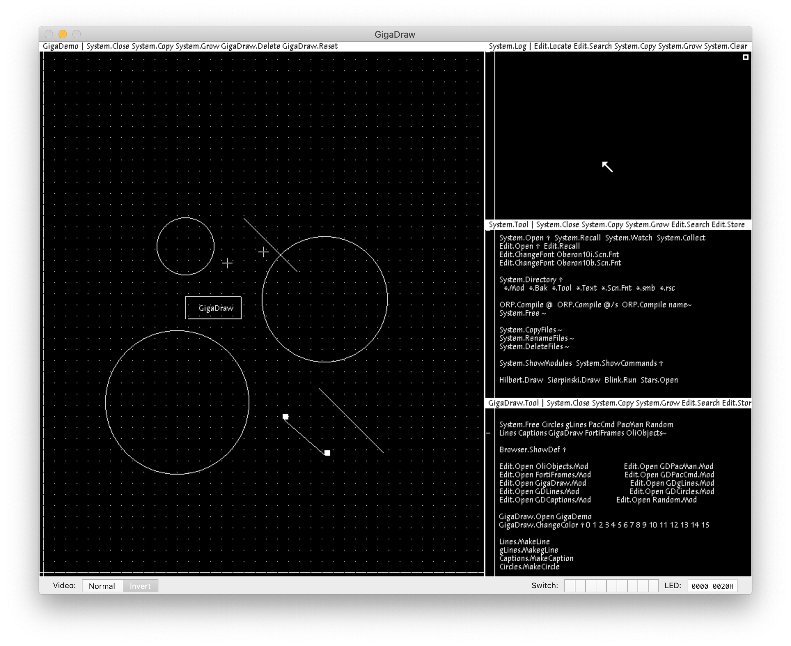

# GigaDraw
## The Ultimate Oberon Drawing App (almost)
### About

**GigaDraw** is a simple drawing application implemented in and running on Oberon systems. It features a genuine black and white drawing engine and an intuitive user interface using Oberon *commands*, coming right out of the 90ties. ;)

### History

**GigaDraw** was developed as a student exercise during the "Systemsoftare" lectures given by professor Niklaus Wirth in the winter semester 1998/99 at the ETH. It was developed in a team of two students.

The original code compiled and ran on Oberon V4 (the name of the operating system) on a Ceres-3 computer. The Ceres 3 computer was the third iteration of a computer using the National Semiconductor NS320xx CPU. The logic board around it was designed by the computer systems group led by professor Niklaus Wirth.

I took Niklaus Wirth's 85th birthday in 2019 as an occasion to "google for Oberon" and I stumbled across [Oberon Core](https://itunes.apple.com/de/app/oberon-core/id1057155516?mt=12), a free Oberon port in the Mac App Store which implements the latest [Oberon 2013](https://inf.ethz.ch/personal/wirth/ProjectOberon/index.html) (Oberon V5), an even more simplified version of the previous V4, based on the also refined [Oberon-07](http://www-oldurls.inf.ethz.ch/personal/wirth/Oberon/Oberon07.Report.pdf) language.

Naturally our original **GigaDraw** code did not compile right away, but the idea to "port it into the new century" was born.

### Screenshots

### References

#### Language and Operating Sytem

* [Oberon](https://inf.ethz.ch/personal/wirth/Oberon/index.html) - Resources about the programming language Oberon (Niklaus Wirth's homepage)
* [Project Oberon 2013](https://inf.ethz.ch/personal/wirth/ProjectOberon/index.html) - description of the Oberon operating system (Niklaus Wirth's homepage)
* [Project Oberon (Homepage)](http://www.projectoberon.com/) - probably the most "official" Oberon website one can find (besides Niklaus Wirth's own homepage)

#### Implementations
* [Oberon RISC emulator](https://github.com/pdewacht/oberon-risc-emu) - Emulates the RISC CPU, originally designed and implemented on an FPGA by Niklaus Wirth.
* [Oberon Core](https://itunes.apple.com/de/app/oberon-core/id1057155516?mt=12) - an implementation of Project Oberon 2013, freely available in the Mac App Store. To my understanding it is based on the above RISC emulator.
* [Experimental Oberon](https://github.com/andreaspirklbauer/Oberon-experimental) - an extended Oberon 2013, (re-)adding new (old) features such as dynamic array allocation, type-bound procedures - and continuous scrolling!
* [Oberon in the Web](https://schierlm.github.io/OberonEmulator/) - a JavaScript based emulator running Oberon right in the browser. Various "disk images" are selectable, including the above Experimental Oberon

